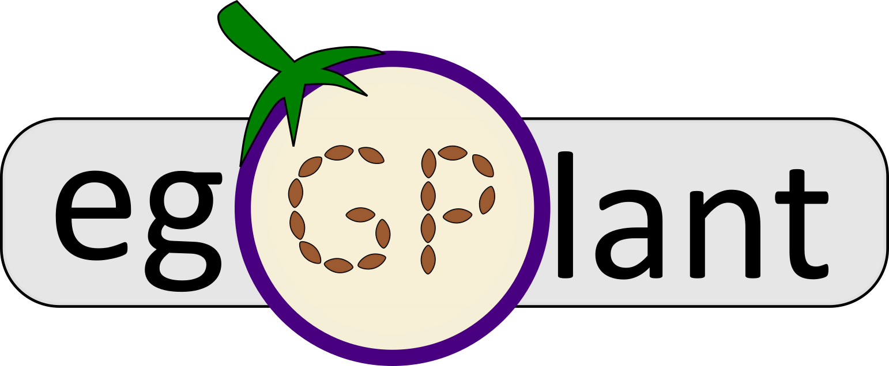

[](https://codecov.io/gh/almaan/eggplant)
[](https://spatial-eggplant.readthedocs.io/en/latest/?badge=latest)
[](https://doi.org/10.5281/zenodo.5659105)


#  

This repository contains the source code for the package *eggplant* presented in
the manuscript *"A Landmark-based Common Coordinate Framework for Spatial
Transcriptomics Data"*; which - in short - is a method designed to transfer
information from multiple spatial-transcriptomics data sets to a single
reference representing a **Common Coordinate Framework** (CCF).

##  Installation and Tutorials
We refer to our <a href="https://spatial-eggplant.readthedocs.io/en/latest/install.html">readthedocs</a> page for instructions regarding installation and examples of use.<br>
<br>
The estimated time for installation is **less than one minute**.<br>
<br>
The software has been tested on a Linux (Fedora 29) and macOS (Catalina) machine.

## Structure
This section outlines the (relevant) structure of the repository:
- `eggplant/` - contains the source code of the Python package
- `data/` - holds the data analyzed in the manuscript (and thus the notebooks included in this repository)
  - `{data-set}/landmarks/` - contains the landmark coordinates for all samples in the associated data set
  - `{data-set}/references` - contains the reference image used for the associated data set
  - `{data-set}/curated` - is a symbolic link (symlink) pointing to a directory that holds the curated (charted) data of the associated data set. See the [Data Access](#data-access) section below for more information.
  - `human-breast-cancer/stereoscope/` - contains the `stereoscope` proportion estimates for the two breast cancer samples
- `data-processing/` - contains scripts to download and covert data to the working format `h5ad` (AnnData files)
  - `{data-set}/download-data.sh` - will download data from the original source
  - `{data-set}/make-h5ad.py` - will convert raw data into `h5ad`-files and add landmark annotations, execute with `python3 make-h5ad.py`
- `notebooks/` - contains notebooks outlining all the analysis presented in the manuscript
  - `synthetic-1-generation-and-analysis.ipynb` - generation and analysis of synthetic data set 1
  - `synthetic-2-generation-and-analysis.ipynb` - generation and analysis of synthetic data set 2
  - `MOB.ipynb` - analysis of the mouse olfactory bulb (MOB) data set (ST1K data, 12 samples)
  - `mouse-hippocampus.ipynb` - analysis of the mouse hippocampus data sets (Visium and Slide-seqV2 data, 2 samples)
  - `human-developmental-heart.ipynb` - analysis of the human developmental heart (Visium data, 7 samples)
  - `human-breast-cancer.ipynb` - analysis of the human breast cancer data set, includes transfer of proportion values (Visium data, 2 samples)
  - `show-reference.ipynb` - notebook to generate visualization of charted data and references, used for main and supplementary figures
  - `estimate-number-of-landmarks.ipynb` - notebook that shows how the lower bound for the number of landmarks to be used in each analysis was estimated.
- `test/` - unit tests
- `landmark-selection/chart.py` - a (very basic) script for landmark selection. This is in experimental mode and not considered as a part of the `eggplant` package.
- `conda/eggplant.yaml` - a minimal conda environment. Using this you should be able to execute all notebooks found in `notebooks/`
- `docs/`  - contains the source code for the [Documentation](https://spatial-eggplant.readthedocs.io/en/latest/). The documentation is built using [Sphinx](https://www.sphinx-doc.org/en/master/) and is hosted on [ReadTheDocs](https://readthedocs.org/).

## Reproducibility
All the analyses presented in the main manuscript together with their results are found in the `notebooks`
folder, see the structure section above for a clear account of what analysis
each notebook (`.ipynb` file) is associated with.

## Data Access
For the public data sets, we provide scripts to download the data from the
original source together with scripts to convert these into the working format
`.h5ad` (used in the notebooks). 

We do not host any data in this repository, except for the landmark coordinates
and the reference structures. This together with the provided scripts are
sufficient to create all the charted data sets. However, for convenience we also
host the charted files (`.h5ad` files) used in the notebooks - in the associated
[Zenodo](https://doi.org/10.5281/zenodo.5659093) repository.

To get the charted `.h5ad` files, visit the Zenodo repository and extract the
content of `eggplant-data.zip` into a folder called `data` that is located at
the same directory level as the root directory of the cloned github repository.
Meaning that (from within the root folder) the following should be true:

```sh
$> ls ../ -1
eggplant
data
```

For easy access, we use symlinks in the root `data` folder; if you're working on
a Windows machine you might experience some issues with this and probably want
to replace these symlinks with the Windows
[equivalent](https://www.howtogeek.com/howto/16226/complete-guide-to-symbolic-links-symlinks-on-windows-or-linux/)
or just move the files into the root's data folder, on UNIX-based systems it
should work without any need for modifications.


## Contributions
### Developers
**Main developer**: Alma Andersson, you can reach me at almaan [at] kth [dot] se. However, if you have questions pertaining to `eggplant` I recommend you to post an issue here on GitHub.
### Special Mentions
We give a special shout-out to these people, who in one way or another have helped out with the improvement of this package:<br>
- Bug catchers:
  - Be the first one to report a bug! (hopefully this list remains short)
- Innovators:
  - Be the first one to suggest a new feature that should be added to `eggplant`

### Contributing
Any contribution is more than welcome and you are strongly encouraged to submit
PR incorporating new features or improving old ones. If you experience issues or
discover a bug, please post an issue.

### Formatting
To keep things clean, we use [black](https://github.com/psf/black) formatting
and [flake8](https://flake8.pycqa.org/en/latest/) to make sure that we adhere to
the style guide. These checks are all taken care of by
[pre-commit](https://pre-commit.com/) - which we strongly recommend you to
install prior to any contributions.
### Tests
To make sure that the code works as intended and to lower the risk of
introducing bugs into it, we employ unit testing. If you're making a major
contribution please consider writing your own *test* and add this to any of the
existing files in the `test` folder, alternatively add a new file. The test
suite we're using is the standard `unittest` module. For codecov, the
[coverage](https://coverage.readthedocs.io/en/6.1.1/) package is used; we aim to
have a codecov > 80%.
