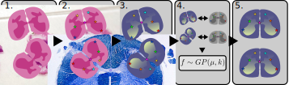

About
=======

What is eggplant?
----------

``eggplant`` is a computational method designed to enable the transfer
of observed spatial data such as for example - but not limited to - gene
expression to a :term:`CCF` (*common coordinate framework*).

The method relies on spatial :term:`landmarks` present in both the observed data
as well as the :term:`reference` we seek to transfer this to. In short, the
spatial distribution of a FOI (feature of interest) is considered as a
multivariate function of the distance to each landmark:

.. math::

   \boldsymbol{y} = f(X)

Where :math:`y_i` is the FOI value at the i:th observation, and :math:`X_{ij}` is the
distance between the j:th landmark and the i:th observation. To learn this
function (:math:`f`) we use *Gaussian Process Regression*. 

How does it work?
~~~~~~

The method is more thoroughly described in it's associated publication, but to
briefly outline the steps, we will use the same flowchart as is presented in
Figure 1A.

1. We pick a number of samples from which we want to transfer information to the reference
2. Then we :term:`chart` the samples
3. Next the FOI(s) that we want to transfer are selected (here spatial gene expression)
4. We then apply Gaussian Process Regression to learn the spatial distribution
   of these features
5. Finally, we predict the gene expression for each location in the reference
   using the learnt (step 4) relationship between landmark distance and feature value.
     

Why the name *eggplant*?
-----------

Aside from being a delicious vegetable, the name is also an acronym for

    **e**\ ffortless **g**\eneric **GP la**\ ndmark **t**\ ransfer

