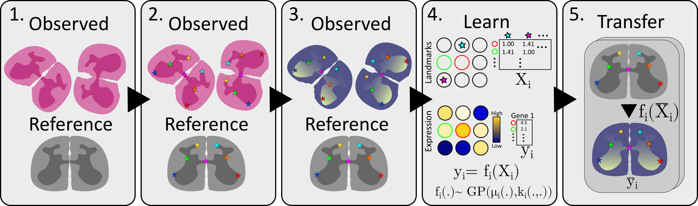
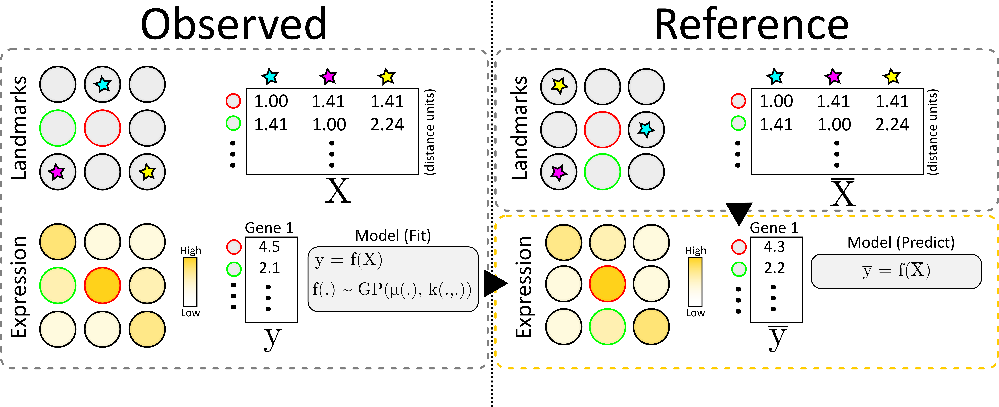

About
=======

What is eggplant?
----------

``eggplant`` is a computational method designed to enable the transfer
of observed spatial data such as for example - but not limited to - gene
expression to a :term:`CCF` (*common coordinate framework*).

The method relies on spatial :term:`landmarks` present in both the observed data
as well as the :term:`reference` we seek to transfer this to. In short, the
spatial distribution of a FOI (feature of interest) is considered as a
multivariate function of the distance to each landmark:

.. math::

   \boldsymbol{y} = f(X)

Where :math:`y_i` is the FOI value at the i:th observation, and :math:`X_{ij}` is the
distance between the j:th landmark and the i:th observation. To learn this
function (:math:`f`) we use *Gaussian Process Regression*. 

How does it work?
~~~~~~

The method is more thoroughly described in it's associated publication, but to
briefly outline the steps, we will use the same flowchart as is presented in
Figure 1A.

1. Construct/choose a reference and select samples to transfer information from
2. Chart the landmarks, i.e., annotate common landmarks
3. Select feature of interest, e.g., expression of your favorite gene
4. Learn a transfer function relating landmark distances to expression
5. Transfer information to the reference, apply transfer function to each location in the reference

To elaborate a bit more on the flow of information from observed data to the
reference we refer to the image below.

We start by creating a distance matrix :math:`X` for the observed data,
containing the distance from every observation to each landmark. Next, we also
create the feature vector :math:`y` containing the values for our feature of
interest at each location. We model :math:`y` as a function (:math:`f`) of
:math:`X` assume that this function is distributed according to a Gaussian
Process, and thus fit it accordingly.

To transfer the information, we first create a similar distance matrix to
:math:`X` but for all of the locations in our *reference*, this is denoted
:math:`\bar{X}`. Finally, we apply the (learnt) function :math:`f` to
:math:`\bar{X}`, rendering a new feature vector :math:`\bar{y}` which represents
an estimate of the feature values at each of the reference locations.

Why the name *eggplant*?
-----------

Aside from being a delicious vegetable, the name is also an acronym for

    **e**\ ffortless **g**\eneric **GP la**\ ndmark **t**\ ransfer

